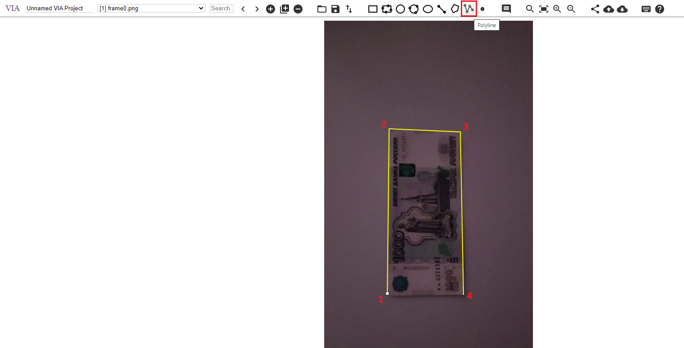

## Описание ##

Данная работа представляет собой модуль автоматической разметки в системе прослеживания купюр на видео.
Основная задача -- ускорение процесса получения разметки купюр на видео, с возможностью итеративной ручной правки результатов автоматической разметки.
Модуль позволяет осуществить следующий пайплайн:
  1) Дано видео с бумажной купюрой на нём, углы купюры могут выходить за границы кадра.
  2) Пользователь проставляет на первом кадре положение углов купюры в согласованной с её положением последовательности (описано далее).
  3) Программа на основе этих данных проводит автоматическую разметку остальных кадров.
  4) (Опционально: оценка) Пользователь может вручную испарвить разметку и сохранить её отдельным файлом для последующего оценивания работы модуля (получить т.н. ground-truth).
  5) (Опционально: оценка) Прогамма оценивает качество автоматической разметки, сравнивая её с исправленной.
  6) Программа показывает пользователю исходное видео с наложенной автоматической разметкой (опционально для оценки: и с исправленной тоже).
  7) Пользователь может исправить вручную разметку на каком-либо кадре и указать программе использование этого кадра как опорного (т.е. для последующей части видео он будет как "первый", с этого момента предыдущая часть как бы "забывается").
  8) Далее действия повторяются, начиная с п.3); если же на текущей итерации получена достаточно качественная разметка, можно завершить цикл.

В качестве удобного интерфейса для разметки используется VIA (Version 3), ссылка: https://www.robots.ox.ac.uk/~vgg/software/via/downloads/via3/via-3.0.11.zip.

Пайплайн разбит на несколько блоков и состоит из плюсового кода + питоновские скрипты-связки.
OpenCV используется плюсовым кодом и только им (сделал так, чтобы не перемешивать между собой питоновскую и плюсовую OpenCV).
Т.е. не требующие OpenCV модули -- на питоне.

## Примеры видео ##

Для проверки модуля были отсняты $18$ видео с купюрами. Длительность в среднем $5-10$ сек с часотой $30$ кадров/сек (порядка $200$ кадров на одно видео), разрешение 608x1080. Снималось на смартфон Xiaomi Mi 10T с последующим сжатием до указанного разрешения. Видео сняты в различных условиях: есть как простые примеры с хорошим освещением и без искажений, так и тёмным помещением или дефокусировкой камеры.

Ссылка на видео (лежат по пути sampleN/video.mp4): https://drive.google.com/drive/folders/1pPoPM-JnA5H36VttmM7PNV5EDzARfOax?usp=sharing.

## Подготовка к запуску ##

cmake не использовался, т.к. в проекте все исполняемые файлы представляют собой либо собранный из одного cpp бинарник, либо питоновский скрипт.

Поэтому для подготовке к работе достаточно:
- Скомпилировать с поддержкой **C++17** каждый из cpp-файлов из директории "src/"
- Для сборки **нужно подтянуть OpenCV** (желательно 4.5.5, т.к. тестировалась на ней).
- Положить бинарники (названия у бинрей должны совпадать с cpp, т.е. "1_parser.cpp"->"1_parser" и т.д.) в "scripts/"

## Как использовать ##

  1) Парсинг видео на кадры (нужно для VIA)
     - Положить видео (обязательно название самого файла "video.mp4") в директорию input/, можно в произвольную поддиректорию относительно "input/"; например, "input/batch2/sample14/video.mp4" (*batch2/sample14/* это выбранная для примеров далее поддиректория, может быть любая другая).
     - Перейти в "scripts/"
     - Запустить бинарь "1_parser", для примера выше командой "1_parser batch2/sample14"
  2) Разметка первого кадра
     - Открыть в VIA все файлы директории "output/batch2/sample14/frames/"
     - На первом кадре (frame0.png) выбрать тип разметки "polyline" и отметить углы от левого верхнего угла по часовой стрелке (как на рисунке)
     - Скачать файл с разметкой (json), переименовать в "1_first_frame_only.json" и переместить в "output/batch2/sample14/json/"
  3) Запуск трекинга
     - Вернуться в "scripts/" и запустить "2_expander.py", команда "2_expander.py batch2/sample14"
     - Запустить бинарь трекера командой "3_tracker batch2/sample14"
  4) (Опционально) Ручное создание истинной разметки
     - Через VIA открыть все файлы директории "output/batch2/sample14/frames/"
     - Через VIA открыть разметку "output/batch2/sample14/json/3_tracker_output.json"
     - Пройти по всем кадрам и подправить точки, если есть заметные отклонения
     - Скачать файл с разметкой (json), переименовать в "4_ground_truth.json" и переместить в "output/batch2/sample14/json/"
  5) (Опционально) Оценка качества разметки
     - В "scripts/" запустить 4_eval.py командой "4_eval.py batch2/sample14/"; он выведет значение функции оценки для целого видео
     - В "output/batch2/sample14/" должен появиться файл "metrics.csv"; это таблица в формате (путь_к_кадру, метрика_на_кадре, флаг_опорного_кадра)
  6) Видео с наложенной разметкой
     - В "scripts/" запустить бинарь 6_visual командой "6_visual batch2/sample14/"
     - Видео можно ставить на паузу пробелом
  7) Добавление опорного кадра
     - Открыть в VIA все файлы директории "output/batch2/sample14/frames/"
     - Открыть в VIA разметку "output/batch2/sample14/json/2_first_frame_expanded.json"
     - В "scripts/" запустить 5_set_manual_flg.py командой "5_set_manual_flg.py batch2/sample14/ {*номер_кадра*} {*1_или_0_флаг_опорный_ли_кадр*}"
  8) Заново выполнить все действия, начиная с п. 3

## Структура проекта ##

При полной отработке пайплайна на всех видео (т.е. с учётом созданных файлов, "максимальное" заполнение) структура директорий будет такой:

    input/            -- директория с входными видео, здесь приведён возможный пример её заполнения поддиректориями
      dir1/
        subdir1/
          video.mp4
        subdir2/
          video.mp4
      dir2/
        video.mp4
    output/         -- директория с выходными данными (фактически копирует структуру input), для примера input выше будет такой:
      dir1/
        subdir1/
          frames/
    	      frame1.png
    	      ...
  	        frameN.png
          json/
            1_first_frame_only.json
            2_first_frame_expanded.json
            3_tracker_output.json
            4_ground_truth.json
          metrics.csv
        subdir2/
          frames/
  	        frame1.png
    	      ...
    	      frameN.png
          json/
            1_first_frame_only.json
            2_first_frame_expanded.json
            3_tracker_output.json
            4_ground_truth.json
          metrics.csv
      dir2/
        frames/
          frame1.png
          ...
          frameN.png
        json/
            1_first_frame_only.json
            2_first_frame_expanded.json
            3_tracker_output.json
            4_ground_truth.json
          metrics.csv
    scripts/
      1_parser
      2_expander.py
      3_tracker
      4_eval.py
      5_set_manual_flg.py
      6_visual
    src/      -- здесь плюсовые исходники
      1_parser.cpp
      3_tracker.cpp
      6_visual.cpp

## Краткое описание используемого подхода и реализации ##

Для трекинга в работе использовался подход с сопоставением особых точек при помощи алгоритма RANSAC. При этом для реализации были применены средства OpenCV:

1) Для получения особых точек и их дескрипторов используется детектор *SIFT* [1]. Он применяется последовательно к каждому кадру.
2) Между опорным и текущим кадрами осуществляется сопоставление дескрипторов поиском (в данной ревлизации, двух) ближайших соседей при помощи структуры *k-d tree*. Реализуется в OpenCV через интерфейс *FlannBasedMatcher* c передачей параметра *FLANN_INDEX_KDTREE* [2].
3) Для вычисления гомографии между опорным и текущим кадрами сопоставленные в п. 2) точки передаются в метод *findHomography* [3]. Для применения алгоритма RANSAC при вызове этого метода передаётся параметр *cv::RANSAC*. Полученная гомография применяется к углам купюры, выделенным на опорном кадре, для получения их положения на текущем кадре.

Итоговый алгоритм трекинга выглядит так:

    Compute arrays of feature points k_0[] and descriptors d_0[] for initial frame f_0
    Save them as reference frame k_ref = k_0, d_ref = d_0
    Initialize banknote corners array cor[] with user values
    Let frames number in video be N
    For i in 1..N:
      Compute arrays of feature points k_i[] and descriptors d_i[] for current frame f_i
      if f_i is marked as reference frame:
        k_ref = k_i, d_ref = d_i
        continue
      Match d_i[] and d_ref[] and save result corresponding pairs <k_ref[l], k_i[m]> in array P
      Find homography H with RANSAC using P
      Apply H to cor, cor[j] = H(cor[j])
      Save/Draw new cor[] values

## Ссылки ##

[1] https://docs.opencv.org/4.x/d7/d60/classcv_1_1SIFT.html

[2] https://docs.opencv.org/4.x/dc/de2/classcv_1_1FlannBasedMatcher.html

[3] https://docs.opencv.org/4.x/d9/d0c/group__calib3d.html#ga4b3841447530523e5272ec05c5d1e411
